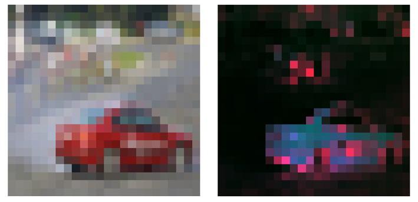

# Cifar10

### Attention Maps
By training a network with "vision transformer" architecture, we have access to the attention maps the network uses.
These tell us, on which parts of the image the network's decision relied. 
  
 

### Paper "Emerging properties in Vision Transformers"
A network with "vision transformer" architecture was trained with only labeled 10k images to simulate a shortage of labeled data.
By self-supervised learning on a bigger, but unlabeled data set, the networks capabilities can be improved significantly.

<!---
|               |  Supervised |  Dino v1  |  Dino v2 |
|---------------|-------------|-----------|----------|
| Val. Loss     |  1.412      |  1.258    |  1.206   |
| Val. Accuracy |  58 %       |  62 %     |  63.5 %  | --->

|            |  Val. Accuracy | Val. Loss |
|------------|----------------|-----------|
| Supervised |  58 %          |  1.41     |
| Dino v1    |  62 %          |  1.26     | 
| Dino v2    |  63.5 %        |  1.21     |

As observed in the paper "Emerging properties in Vision Transformers", segmentation like attention masks appear
while training it unsupervised, i. e. it only gets images, *no labels, no segmentation masks as input*.
